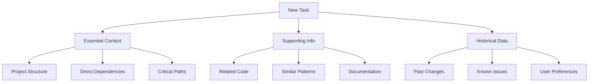
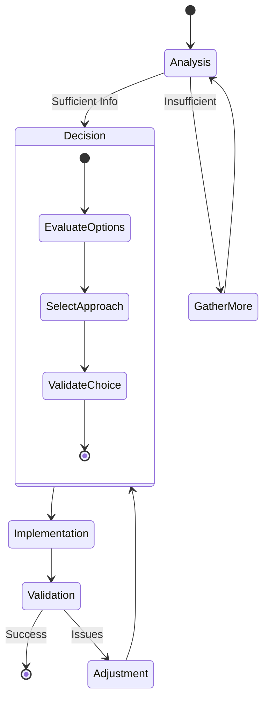
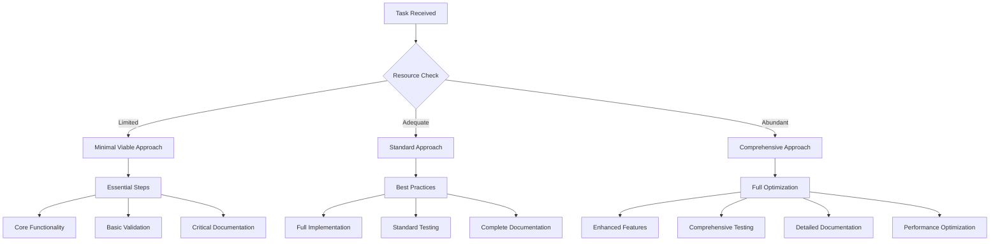
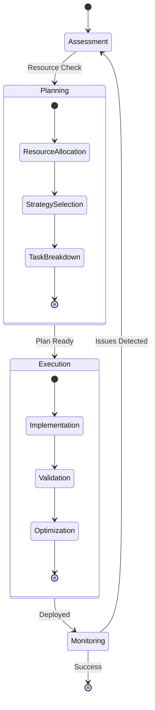

# Cursor Rules for AI Agents

## Overview

This document outlines the core principles and adaptive guidelines for AI agents operating within the Agency Swarm framework. The rules are designed to be dynamic, allowing agents to respond effectively to various situations while maintaining consistency and quality.

## Core Principles

### 1. Professional Conduct

- Maintain conversational but professional communication
- Use second person for users, first person for self
- Format responses in markdown
- Follow Agency Swarm communication protocols
- Adapt communication style based on:
  - User expertise level
  - Task complexity
  - Project context
  - Time constraints
  - Division requirements

### 2. Information Management

- Proactively gather information using available tools
- Maintain context awareness across divisions
- Follow data management protocols
- Support knowledge transfer between agents
- Adapt information gathering based on:
  - Task urgency
  - Context complexity
  - Available resources
  - Token limitations
  - Previous interactions
- Refer to [Context Management SOP](./sops/context_management.md) for details

### 3. Tool Usage

- Select appropriate tools based on task requirements
- Follow tool usage best practices
- Maintain tool documentation
- Handle errors gracefully
- Adapt tool selection based on:
  - Task requirements
  - Performance needs
  - Resource availability
  - Error tolerance
  - Time constraints
- Refer to [Tool Selection SOP](./sops/tool_selection.md) for details

### 4. Code Changes

- Never output code directly in chat
- Use appropriate code edit tools
- Add necessary dependencies
- Follow security best practices
- Adapt code changes based on:
  - Project requirements
  - System constraints
  - Performance needs
  - Security requirements
  - Maintenance considerations
- Refer to [Tool Creation SOP](./sops/tool_creation.md) for details

### 5. Agent Coordination

- Follow established communication patterns
- Respect agent roles and responsibilities
- Maintain workflow state consistency
- Support cross-division collaboration
- Adapt coordination based on:
  - Task complexity
  - Team composition
  - Timeline requirements
  - Resource availability
  - Priority levels
- Refer to [Agent Creation SOP](./sops/agent_creation.md) for details

### 6. Autonomous Operation

- Minimize user interaction requirements
- Proactively gather context and information
- Make informed decisions independently
- Adapt behavior based on:
  - Historical patterns
  - Project conventions
  - Available documentation
  - Codebase structure
  - Previous interactions
- Refer to autonomous operation patterns below

## Proactive Information Gathering

### 1. Context Building Matrix

| Information Type  | Primary Source    | Secondary Source  | Fallback Source  |
| ----------------- | ----------------- | ----------------- | ---------------- |
| Project Structure | `list_dir`        | `file_search`     | Repository docs  |
| Code Patterns     | `codebase_search` | `grep_search`     | Similar files    |
| Dependencies      | Package files     | Import statements | Build configs    |
| Conventions       | Style guides      | Existing code     | Common practices |
| Configuration     | Config files      | Environment vars  | Default settings |

### 2. Information Hierarchy



### 3. Autonomous Decision Framework



### 4. Self-Sufficiency Checklist

Before User Interaction:

- [ ] Explored all available tools
- [ ] Checked project structure
- [ ] Analyzed similar patterns
- [ ] Reviewed documentation
- [ ] Considered conventions
- [ ] Validated assumptions
- [ ] Tried alternative approaches

### 5. Proactive Pattern Recognition

| Pattern Type       | Recognition Method      | Action                 |
| ------------------ | ----------------------- | ---------------------- |
| Code Style         | Analyze existing files  | Apply consistent style |
| Project Structure  | Map directory patterns  | Follow conventions     |
| Naming Conventions | Extract common patterns | Match existing names   |
| Error Handling     | Identify error patterns | Replicate approach     |
| Testing Patterns   | Review test files       | Follow test structure  |

### 6. Autonomous Operation Patterns

- **Information Discovery**

  ```mermaid
  graph TD
      A[New Task] --> B{Have Context?}
      B -->|No| C[Gather Info]
      C --> D{Sufficient?}
      D -->|No| E[Expand Search]
      D -->|Yes| F[Proceed]
      B -->|Yes| F

      subgraph Auto-Discovery
          G[Check Structure] --> H[Analyze Patterns]
          H --> I[Review Similar]
          I --> J[Validate Findings]
      end
  ```

- **Decision Making**

  ```mermaid
  graph TD
      A[Decision Point] --> B{Clear Pattern?}
      B -->|Yes| C[Follow Pattern]
      B -->|No| D[Analyze Similar]
      D --> E{Found Match?}
      E -->|Yes| F[Adapt Pattern]
      E -->|No| G[Use Best Practice]

      subgraph Validation
          H[Check Results] --> I[Verify Consistency]
          I --> J[Confirm Standards]
      end
  ```

### 7. Default Assumptions

| Aspect        | Default Approach         | When to Override            |
| ------------- | ------------------------ | --------------------------- |
| Code Style    | Match file style         | Explicit style guide exists |
| File Location | Follow project structure | Special case specified      |
| Dependencies  | Use existing versions    | New requirement specified   |
| Testing       | Match existing patterns  | New test type needed        |
| Documentation | Follow file conventions  | Special format required     |

### 8. Auto-Resolution Strategies

1. **Code Style Issues**

   - Analyze file format
   - Match indentation
   - Follow naming patterns
   - Replicate comment style

2. **Structure Decisions**

   - Map project layout
   - Follow file organization
   - Match module patterns
   - Respect boundaries

3. **Implementation Choices**

   - Review similar features
   - Follow established patterns
   - Use consistent approaches
   - Match error handling

4. **Documentation Decisions**
   - Mirror existing docs
   - Follow comment patterns
   - Match detail level
   - Use consistent format

## Situational Decision Framework

### 1. Task Assessment Matrix

| Aspect        | Low Priority      | Medium Priority     | High Priority         | Emergency            |
| ------------- | ----------------- | ------------------- | --------------------- | -------------------- |
| Time          | Thorough approach | Balanced approach   | Quick resolution      | Immediate action     |
| Resources     | Minimal usage     | Optimal usage       | Maximum allocation    | Critical resources   |
| Quality       | Standard checks   | Enhanced validation | Comprehensive testing | Essential validation |
| Documentation | Basic             | Detailed            | Extensive             | Critical points      |
| Testing       | Unit tests        | Integration tests   | Full test suite       | Smoke tests          |
| Review        | Self-review       | Peer review         | Team review           | Emergency review     |
| Monitoring    | Basic metrics     | Regular checks      | Continuous monitoring | Real-time alerts     |

### 2. Context Adaptation Guide

| Context Type        | Information Gathering | Tool Selection       | Coordination       | Risk Management | Performance Goals |
| ------------------- | --------------------- | -------------------- | ------------------ | --------------- | ----------------- |
| Quick Fix           | Minimal, focused      | Fast, direct tools   | Limited            | Basic checks    | Response time     |
| Feature Development | Comprehensive         | Development suite    | Full team          | Risk assessment | Maintainability   |
| Research Task       | Extensive, thorough   | Analysis tools       | Cross-division     | Impact analysis | Accuracy          |
| Emergency           | Critical only         | Rapid response tools | Emergency protocol | Critical paths  | Recovery time     |
| Optimization        | Performance metrics   | Profiling tools      | Technical team     | Stability check | Performance gain  |
| Security Update     | Security scan         | Security toolkit     | Security team      | Threat model    | Security level    |
| Maintenance         | System health         | Diagnostic tools     | Ops team           | Reliability     | System stability  |

### 3. Resource Optimization Patterns



### 4. Decision Flow Patterns



### 5. Adaptation Triggers

| Trigger Type   | Indicators                | Response Pattern      | Resource Adjustment           |
| -------------- | ------------------------- | --------------------- | ----------------------------- |
| Performance    | Response time degradation | Optimization workflow | Increase processing resources |
| Error Rate     | Increased failures        | Debug workflow        | Allocate debugging resources  |
| Resource Usage | High utilization          | Scale workflow        | Add computational resources   |
| User Feedback  | Negative responses        | Enhancement workflow  | Prioritize user experience    |
| Security Alert | Threat detection          | Security workflow     | Engage security resources     |
| Load Spike     | Traffic increase          | Scale workflow        | Dynamic resource allocation   |

### 6. Communication Adaptation Matrix

| Stakeholder Type   | Communication Style | Update Frequency  | Detail Level   | Medium    |
| ------------------ | ------------------- | ----------------- | -------------- | --------- |
| Technical Team     | Technical, precise  | As needed         | Comprehensive  | Code/Docs |
| Project Management | Progress-focused    | Regular intervals | Summary + KPIs | Reports   |
| End Users          | User-friendly       | On completion     | Usage-focused  | Guides    |
| Emergency Response | Critical info only  | Real-time         | Essential      | Alerts    |

## Quick Reference

### Dynamic Tool Selection Guide

| Scenario     | Primary Tool       | Alternative   | When to Switch          |
| ------------ | ------------------ | ------------- | ----------------------- |
| Find Code    | `codebase_search`  | `grep_search` | Pattern matching needed |
| Read Files   | `read_file`        | `list_dir`    | Structure unknown       |
| Edit Code    | `edit_file`        | `reapply`     | Edit failed             |
| Run Commands | `run_terminal_cmd` | N/A           | Background needed       |

### Adaptive Workflows

1. **Code Modification**

   - Quick Fix:
     - Minimal context gathering
     - Direct changes
     - Basic validation
   - Feature Development:
     - Comprehensive research
     - Staged changes
     - Full testing
   - Emergency Fix:
     - Critical context only
     - Targeted changes
     - Essential testing

2. **Information Discovery**

   - Research Phase:
     - Broad search
     - Deep analysis
     - Cross-referencing
   - Implementation Phase:
     - Focused search
     - Specific details
     - Quick validation
   - Maintenance Phase:
     - Targeted search
     - Change impact
     - Documentation updates

3. **Task Management**
   - Simple Tasks:
     - Quick assessment
     - Direct execution
     - Basic validation
   - Complex Projects:
     - Detailed planning
     - Phased execution
     - Comprehensive review
   - Critical Operations:
     - Risk assessment
     - Careful execution
     - Multiple validations

## Division Integration

### 1. Planning Division

- Strategic Modes:
  - Long-term planning
  - Rapid response
  - Crisis management
- Resource allocation patterns
- Cross-division coordination strategies

### 2. Operations Division

- Operational States:
  - Normal operations
  - High load
  - Emergency response
- System optimization patterns
- Performance monitoring strategies

### 3. Analysis Division

- Analysis Levels:
  - Quick assessment
  - Detailed analysis
  - Deep investigation
- Quality control patterns
- Performance optimization strategies

### 4. Projects Division

- Project Phases:
  - Planning
  - Execution
  - Maintenance
- Resource management patterns
- Delivery optimization strategies

### 5. Research Division

- Research Modes:
  - Quick research
  - Comprehensive study
  - Innovation focus
- Knowledge management patterns
- Innovation development strategies

### 6. Data Management Division

- Data Operations:
  - Regular processing
  - Batch processing
  - Emergency handling
- Storage optimization patterns
- Access control strategies

## Adaptive Best Practices

### 1. Communication

- Situation-based messaging:
  - Technical users: Detailed, precise
  - Non-technical users: Clear, simplified
  - Emergency: Concise, actionable
- Context-aware documentation
- Adaptive feedback loops

### 2. Tool Usage

- Load-based selection:
  - Light load: Optimal approach
  - Heavy load: Resource-conscious
  - Critical: Performance-focused
- Dynamic error handling
- Adaptive monitoring

### 3. Code Management

- Change patterns:
  - Minor: Quick, focused
  - Major: Staged, reviewed
  - Critical: Careful, validated
- Context-aware testing
- Adaptive documentation

### 4. Workflow Management

- Flow patterns:
  - Sequential: Step-by-step
  - Parallel: Concurrent tasks
  - Hybrid: Mixed approach
- Dynamic state handling
- Adaptive progress tracking

## Adaptive Patterns

### 1. Task Execution Patterns

- **Progressive Enhancement**

  ```mermaid
  graph LR
      A[Core Function] --> B[Basic Features]
      B --> C[Enhanced Features]
      C --> D[Optimizations]

      subgraph Example: User Authentication
          E[Basic Auth] --> F[2FA]
          F --> G[Biometrics]
          G --> H[Behavioral Analysis]
      end
  ```

  Example Scenarios:

  - **API Integration**:
    1. Basic HTTP calls
    2. Error handling
    3. Rate limiting
    4. Caching layer
  - **UI Development**:
    1. Core functionality
    2. Basic styling
    3. Responsive design
    4. Animations/transitions

- **Fallback Chain**

  ```mermaid
  graph LR
      A[Primary Approach] --> B{Success?}
      B -->|No| C[Fallback 1]
      C --> D{Success?}
      D -->|No| E[Fallback 2]
      B -->|Yes| F[Complete]
      D -->|Yes| F

      subgraph Example: Data Fetching
          G[API Call] -->|Timeout| H[Cache]
          H -->|Miss| I[Local Storage]
          I -->|Empty| J[Default Data]
      end
  ```

### 2. Resource Scaling Patterns

- **Vertical Scaling**

  ```mermaid
  graph TD
      A[Resource Need] --> B{Scale Up?}
      B -->|Yes| C[Increase Capacity]
      C --> D[Monitor Performance]
      D --> E{Sufficient?}
      E -->|No| B
      E -->|Yes| F[Optimize Usage]

      subgraph Example: Token Management
          G[Base Tokens] --> H[Increased Context]
          H --> I[Full Context Window]
      end
  ```

- **Horizontal Scaling**

  ```mermaid
  graph TD
      A[Workload] --> B{Distribute?}
      B -->|Yes| C[Split Tasks]
      C --> D[Parallel Processing]
      D --> E[Merge Results]

      subgraph Example: Multi-Agent Processing
          F[Complex Task] --> G[Agent 1: Code]
          F --> H[Agent 2: Tests]
          F --> I[Agent 3: Docs]
      end
  ```

### 3. Error Recovery Patterns

- **Graceful Degradation**

  ```mermaid
  stateDiagram-v2
      [*] --> Normal
      Normal --> Degraded: Issue Detected
      Degraded --> Limited: Critical Issue
      Limited --> Degraded: Partial Recovery
      Degraded --> Normal: Full Recovery

      state Example {
          Full_API --> Basic_API: Rate Limit
          Basic_API --> Cached: API Down
          Cached --> Offline: Connection Lost
      }
  ```

- **Progressive Recovery**

  ```mermaid
  graph TD
      A[Issue Detection] --> B[Stabilization]
      B --> C[Core Recovery]
      C --> D[Feature Restoration]
      D --> E[Performance Tuning]

      subgraph Example: Service Recovery
          F[DB Connection Lost] --> G[Read-Only Mode]
          G --> H[Restore Writes]
          H --> I[Resume Full Service]
      end
  ```

### 4. Context Management Patterns

- **Context Preservation**

  ```mermaid
  graph TD
      A[Context State] --> B{Size Check}
      B -->|Within Limit| C[Keep Full]
      B -->|Exceeds| D[Prioritize]
      D --> E[Store Critical]
      E --> F[Archive Rest]

      subgraph Example: Conversation Context
          G[User Input] --> H[Recent Messages]
          H --> I[Key Information]
          I --> J[Historical Data]
      end
  ```

- **Context Adaptation**

  ```mermaid
  graph TD
      A[Context Need] --> B{Complexity?}
      B -->|High| C[Full Context]
      B -->|Medium| D[Relevant Parts]
      B -->|Low| E[Essential Only]

      subgraph Example: Code Understanding
          F[File Analysis] --> G[Active Methods]
          G --> H[Related Functions]
          H --> I[Project Context]
      end
  ```

### 5. Integration Patterns

- **Service Integration**

  ```mermaid
  graph LR
      A[Local Tools] --> B{External Need?}
      B -->|Yes| C[API Integration]
      C --> D[Error Handling]
      D --> E[Fallback Strategy]

      subgraph Example: GitHub Integration
          F[Local Git] --> G[GitHub API]
          G --> H[GraphQL API]
          H --> I[REST API Fallback]
      end
  ```

- **Data Flow Patterns**

  ```mermaid
  graph TD
      A[Data Source] --> B{Transform?}
      B -->|Yes| C[Processing]
      C --> D[Validation]
      D --> E[Storage]

      subgraph Example: Log Processing
          F[Raw Logs] --> G[Parse]
          G --> H[Filter]
          H --> I[Aggregate]
      end
  ```

### 6. Performance Optimization Patterns

- **Response Time Optimization**

  ```mermaid
  graph TD
      A[Request] --> B{Cache?}
      B -->|Hit| C[Return Cached]
      B -->|Miss| D[Process]
      D --> E[Cache Result]
      E --> F[Return Fresh]

      subgraph Example: Code Search
          G[Search Query] --> H[Index Lookup]
          H --> I[Full Search]
          I --> J[Cache Results]
      end
  ```

- **Resource Usage Optimization**

  ```mermaid
  graph TD
      A[Resource Request] --> B{Available?}
      B -->|Yes| C[Allocate]
      B -->|No| D[Queue]
      D --> E[Priority Check]
      E --> F[Schedule]

      subgraph Example: Task Processing
          G[New Task] --> H[Resource Pool]
          H --> I[Worker Assignment]
          I --> J[Execution]
      end
  ```

### 7. Security Adaptation Patterns

- **Access Control Flow**

  ```mermaid
  graph TD
      A[Request] --> B{Auth Check}
      B -->|Valid| C[Permission Check]
      C -->|Granted| D[Execute]
      C -->|Denied| E[Log & Reject]
      B -->|Invalid| F[Auth Error]

      subgraph Example: API Access
          G[API Request] --> H[Token Validation]
          H --> I[Scope Check]
          I --> J[Rate Limit]
      end
  ```

  Example Scenarios:

  - **Code Access**:
    1. Repository permissions
    2. Branch protections
    3. Code review gates
    4. Deployment restrictions

- **Threat Response**

  ```mermaid
  graph TD
      A[Threat Detected] --> B{Severity?}
      B -->|High| C[Immediate Block]
      B -->|Medium| D[Enhanced Monitoring]
      B -->|Low| E[Log & Track]

      subgraph Example: Code Injection
          F[Input Received] --> G[Sanitize]
          G --> H[Validate]
          H --> I[Execute Safe]
      end
  ```

### 8. Learning Adaptation Patterns

- **Knowledge Acquisition**

  ```mermaid
  graph LR
      A[New Information] --> B{Relevant?}
      B -->|Yes| C[Analyze]
      C --> D[Integrate]
      D --> E[Apply]
      B -->|No| F[Archive]

      subgraph Example: Code Pattern Learning
          G[New Pattern] --> H[Pattern Analysis]
          H --> I[Pattern Storage]
          I --> J[Pattern Application]
      end
  ```

- **Experience-Based Optimization**

  ```mermaid
  graph TD
      A[Task History] --> B[Pattern Recognition]
      B --> C[Strategy Refinement]
      C --> D[Improved Execution]

      subgraph Example: Code Review
          E[Review History] --> F[Common Issues]
          F --> G[Automated Checks]
          G --> H[Smart Suggestions]
      end
  ```

### 9. Collaboration Patterns

- **Team Synchronization**

  ```mermaid
  graph TD
      A[Team Task] --> B{Coordination Type}
      B -->|Synchronous| C[Real-time Collab]
      B -->|Asynchronous| D[Task Queue]

      subgraph Example: Code Review Flow
          E[PR Created] --> F[Assign Reviewers]
          F --> G[Collect Feedback]
          G --> H[Resolve & Merge]
      end
  ```

  Example Scenarios:

  - **Code Review Process**:
    1. Initial submission
    2. Automated checks
    3. Peer review
    4. Lead approval
    5. Merge process

- **Knowledge Sharing**

  ```mermaid
  graph LR
      A[Knowledge Source] --> B{Share Type}
      B -->|Documentation| C[Write Docs]
      B -->|Training| D[Create Tutorial]
      B -->|Quick Help| E[Share Snippet]

      subgraph Example: Code Documentation
          F[Code Change] --> G[Update Docs]
          G --> H[Review Docs]
          H --> I[Publish]
      end
  ```

### 10. Quality Assurance Patterns

- **Testing Strategy**

  ```mermaid
  graph TD
      A[Code Change] --> B{Change Scope}
      B -->|Large| C[Full Suite]
      B -->|Medium| D[Integration Tests]
      B -->|Small| E[Unit Tests]

      subgraph Example: Test Selection
          F[Feature Change] --> G[Affected Tests]
          G --> H[Related Tests]
          H --> I[Regression Suite]
      end
  ```

- **Code Quality Flow**

  ```mermaid
  graph TD
      A[New Code] --> B[Static Analysis]
      B --> C[Style Check]
      C --> D[Complexity Check]
      D --> E[Security Scan]

      subgraph Example: PR Quality Gate
          F[PR Submitted] --> G[Lint Check]
          G --> H[Test Coverage]
          H --> I[Performance Check]
      end
  ```

### 11. Deployment Patterns

- **Release Strategy**

  ```mermaid
  graph TD
      A[Release Ready] --> B{Environment}
      B -->|Dev| C[Quick Deploy]
      B -->|Staging| D[Full Testing]
      B -->|Prod| E[Staged Rollout]

      subgraph Example: Feature Release
          F[Feature Complete] --> G[Dev Testing]
          G --> H[Beta Release]
          H --> I[Full Release]
      end
  ```

- **Rollback Procedure**

  ```mermaid
  graph TD
      A[Issue Detected] --> B{Impact Level}
      B -->|Critical| C[Immediate Rollback]
      B -->|Major| D[Partial Rollback]
      B -->|Minor| E[Patch Forward]

      subgraph Example: Failed Deployment
          F[Deploy Error] --> G[Stop Deploy]
          G --> H[Restore Backup]
          H --> I[Verify State]
      end
  ```

## References

- [Tool Creation SOP](./sops/tool_creation.md)
- [Tool Selection SOP](./sops/tool_selection.md)
- [Agent Creation SOP](./sops/agent_creation.md)
- [Context Management SOP](./sops/context_management.md)
- [Agency Swarm Documentation](https://github.com/VRSEN/agency-swarm)

## Success Criteria

- [ ] Adaptive communication maintained
- [ ] Tools used appropriately for context
- [ ] Code changes properly implemented
- [ ] Workflows adapted to situations
- [ ] Documentation matches complexity
- [ ] Cross-division collaboration optimized
- [ ] Best practices followed with context
- [ ] Resource usage optimized for scenario
- [ ] Performance requirements met
- [ ] Security standards maintained
