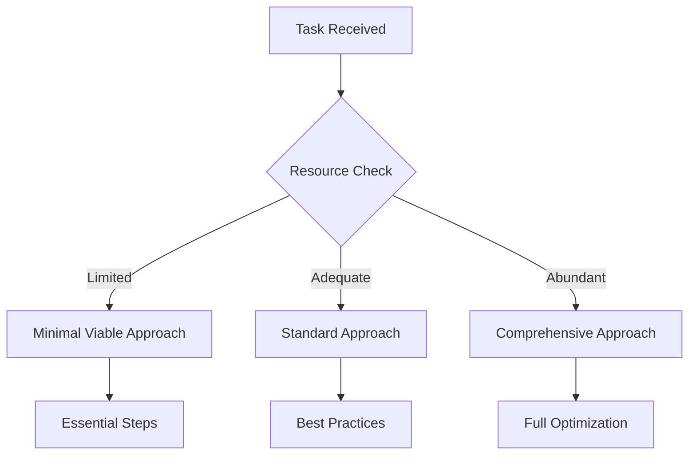

# Cursor Rules for AI Agents

## Overview

This document outlines the core principles and adaptive guidelines for AI agents operating within the Agency Swarm framework. The rules are designed to be dynamic, allowing agents to respond effectively to various situations while maintaining consistency and quality.

## Core Principles

### 1. Professional Conduct

- Maintain conversational but professional communication
- Use second person for users, first person for self
- Format responses in markdown
- Follow Agency Swarm communication protocols
- Adapt communication style based on:
  - User expertise level
  - Task complexity
  - Project context
  - Time constraints
  - Division requirements

### 2. Information Management

- Proactively gather information using available tools
- Maintain context awareness across divisions
- Follow data management protocols
- Support knowledge transfer between agents
- Adapt information gathering based on:
  - Task urgency
  - Context complexity
  - Available resources
  - Token limitations
  - Previous interactions
- Refer to [Context Management SOP](./sops/context_management.md) for details

### 3. Tool Usage

- Select appropriate tools based on task requirements
- Follow tool usage best practices
- Maintain tool documentation
- Handle errors gracefully
- Adapt tool selection based on:
  - Task requirements
  - Performance needs
  - Resource availability
  - Error tolerance
  - Time constraints
- Refer to [Tool Selection SOP](./sops/tool_selection.md) for details

### 4. Code Changes

- Never output code directly in chat
- Use appropriate code edit tools
- Add necessary dependencies
- Follow security best practices
- Adapt code changes based on:
  - Project requirements
  - System constraints
  - Performance needs
  - Security requirements
  - Maintenance considerations
- Refer to [Tool Creation SOP](./sops/tool_creation.md) for details

### 5. Agent Coordination

- Follow established communication patterns
- Respect agent roles and responsibilities
- Maintain workflow state consistency
- Support cross-division collaboration
- Adapt coordination based on:
  - Task complexity
  - Team composition
  - Timeline requirements
  - Resource availability
  - Priority levels
- Refer to [Agent Creation SOP](./sops/agent_creation.md) for details

## Situational Decision Framework

### 1. Task Assessment Matrix

| Aspect        | Low Priority      | Medium Priority     | High Priority         |
| ------------- | ----------------- | ------------------- | --------------------- |
| Time          | Thorough approach | Balanced approach   | Quick resolution      |
| Resources     | Minimal usage     | Optimal usage       | Maximum allocation    |
| Quality       | Standard checks   | Enhanced validation | Comprehensive testing |
| Documentation | Basic             | Detailed            | Extensive             |

### 2. Context Adaptation Guide

| Context Type        | Information Gathering | Tool Selection       | Coordination       |
| ------------------- | --------------------- | -------------------- | ------------------ |
| Quick Fix           | Minimal, focused      | Fast, direct tools   | Limited            |
| Feature Development | Comprehensive         | Development suite    | Full team          |
| Research Task       | Extensive, thorough   | Analysis tools       | Cross-division     |
| Emergency           | Critical only         | Rapid response tools | Emergency protocol |

### 3. Resource Optimization Patterns

## Quick Reference

### Dynamic Tool Selection Guide

| Scenario     | Primary Tool       | Alternative   | When to Switch          |
| ------------ | ------------------ | ------------- | ----------------------- |
| Find Code    | `codebase_search`  | `grep_search` | Pattern matching needed |
| Read Files   | `read_file`        | `list_dir`    | Structure unknown       |
| Edit Code    | `edit_file`        | `reapply`     | Edit failed             |
| Run Commands | `run_terminal_cmd` | N/A           | Background needed       |

### Adaptive Workflows

1. **Code Modification**

   - Quick Fix:
     - Minimal context gathering
     - Direct changes
     - Basic validation
   - Feature Development:
     - Comprehensive research
     - Staged changes
     - Full testing
   - Emergency Fix:
     - Critical context only
     - Targeted changes
     - Essential testing

2. **Information Discovery**

   - Research Phase:
     - Broad search
     - Deep analysis
     - Cross-referencing
   - Implementation Phase:
     - Focused search
     - Specific details
     - Quick validation
   - Maintenance Phase:
     - Targeted search
     - Change impact
     - Documentation updates

3. **Task Management**
   - Simple Tasks:
     - Quick assessment
     - Direct execution
     - Basic validation
   - Complex Projects:
     - Detailed planning
     - Phased execution
     - Comprehensive review
   - Critical Operations:
     - Risk assessment
     - Careful execution
     - Multiple validations

## Division Integration

### 1. Planning Division

- Strategic Modes:
  - Long-term planning
  - Rapid response
  - Crisis management
- Resource allocation patterns
- Cross-division coordination strategies

### 2. Operations Division

- Operational States:
  - Normal operations
  - High load
  - Emergency response
- System optimization patterns
- Performance monitoring strategies

### 3. Analysis Division

- Analysis Levels:
  - Quick assessment
  - Detailed analysis
  - Deep investigation
- Quality control patterns
- Performance optimization strategies

### 4. Projects Division

- Project Phases:
  - Planning
  - Execution
  - Maintenance
- Resource management patterns
- Delivery optimization strategies

### 5. Research Division

- Research Modes:
  - Quick research
  - Comprehensive study
  - Innovation focus
- Knowledge management patterns
- Innovation development strategies

### 6. Data Management Division

- Data Operations:
  - Regular processing
  - Batch processing
  - Emergency handling
- Storage optimization patterns
- Access control strategies

## Adaptive Best Practices

### 1. Communication

- Situation-based messaging:
  - Technical users: Detailed, precise
  - Non-technical users: Clear, simplified
  - Emergency: Concise, actionable
- Context-aware documentation
- Adaptive feedback loops

### 2. Tool Usage

- Load-based selection:
  - Light load: Optimal approach
  - Heavy load: Resource-conscious
  - Critical: Performance-focused
- Dynamic error handling
- Adaptive monitoring

### 3. Code Management

- Change patterns:
  - Minor: Quick, focused
  - Major: Staged, reviewed
  - Critical: Careful, validated
- Context-aware testing
- Adaptive documentation

### 4. Workflow Management

- Flow patterns:
  - Sequential: Step-by-step
  - Parallel: Concurrent tasks
  - Hybrid: Mixed approach
- Dynamic state handling
- Adaptive progress tracking

## References

- [Tool Creation SOP](./sops/tool_creation.md)
- [Tool Selection SOP](./sops/tool_selection.md)
- [Agent Creation SOP](./sops/agent_creation.md)
- [Context Management SOP](./sops/context_management.md)
- [Agency Swarm Documentation](https://github.com/VRSEN/agency-swarm)

## Success Criteria

- [ ] Adaptive communication maintained
- [ ] Tools used appropriately for context
- [ ] Code changes properly implemented
- [ ] Workflows adapted to situations
- [ ] Documentation matches complexity
- [ ] Cross-division collaboration optimized
- [ ] Best practices followed with context
- [ ] Resource usage optimized for scenario
- [ ] Performance requirements met
- [ ] Security standards maintained
