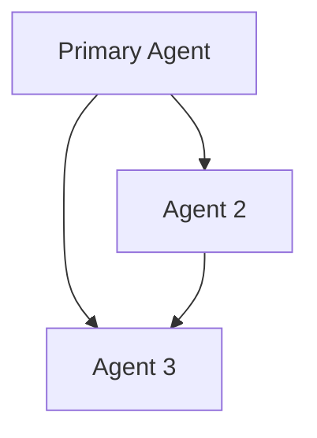

# Standard Operating Procedure: Agent Creation with Agency Swarm

## Overview

This SOP outlines the process for creating and configuring agents within the Agency Swarm framework, ensuring proper initialization, role definition, and integration with the agency ecosystem.

## Prerequisites

- Agency Swarm framework installed
- Python 3.8+
- Access to project repository
- Understanding of agent-based architectures

## Procedure

### 1. Agent Template Creation

#### 1.1 Initialize Agent Template

```bash
agency-swarm create-agent-template --name "AgentName" --description "Agent Description" --path "/path/to/agency/folder"
```

#### 1.2 Generated Structure

```
agent_name/
├── __init__.py
├── agent_name.py
├── instructions.md
└── tools/
    └── __init__.py
```

### 2. Agent Class Implementation

#### 2.1 Basic Agent Structure

```python
from agency_swarm import Agent
from typing import Optional, List
from pathlib import Path

class CustomAgent(Agent):
    def __init__(self):
        super().__init__(
            name="AgentName",
            description="Detailed description of agent's role and responsibilities",
            instructions="./instructions.md",
            tools_folder="./tools",
            temperature=0.5,
            max_prompt_tokens=25000,
        )
```

#### 2.2 Configuration Parameters

| Parameter         | Description               | Example Value                         |
| ----------------- | ------------------------- | ------------------------------------- |
| name              | Agent's identifier        | "DevelopmentAgent"                    |
| description       | Role summary              | "Handles code development and review" |
| instructions      | Path to instructions      | "./instructions.md"                   |
| tools_folder      | Path to tools             | "./tools"                             |
| temperature       | Response creativity (0-1) | 0.5                                   |
| max_prompt_tokens | Token limit               | 25000                                 |

### 3. Agent Instructions

#### 3.1 Instructions Template (instructions.md)

```markdown
# Agent Role

[Detailed description of the agent's role in the agency]

# Goals

1. [Primary goal]
2. [Secondary goal]
3. [Additional goals...]

# Process Workflow

1. [Step 1 description]
2. [Step 2 description]
3. [Additional steps...]

# Guidelines

1. [Guideline 1]
2. [Guideline 2]
3. [Additional guidelines...]
```

#### 3.2 Key Components

1. **Role Definition**

   - Clear purpose statement
   - Scope of responsibilities
   - Position in agency hierarchy
   - Interaction boundaries

2. **Goals**

   - Specific objectives
   - Success criteria
   - Performance metrics
   - Expected outcomes

3. **Workflow**
   - Step-by-step procedures
   - Decision points
   - Interaction patterns
   - Error handling

### 4. Tool Integration

#### 4.1 Adding Custom Tools

```python
from agency_swarm.tools import BaseTool
from custom_tools import CustomTool1, CustomTool2

class CustomAgent(Agent):
    def __init__(self):
        super().__init__(
            name="AgentName",
            tools=[CustomTool1, CustomTool2],
            # ... other parameters
        )
```

#### 4.2 Built-in Tools

```python
from agency_swarm.tools import CodeInterpreter, FileSearch

class CustomAgent(Agent):
    def __init__(self):
        super().__init__(
            name="AgentName",
            tools=[CodeInterpreter, FileSearch],
            # ... other parameters
        )
```

### 5. Agency Integration

#### 5.1 Agency Configuration

```python
from agency_swarm import Agency
from .agents import Agent1, Agent2, Agent3

agent1 = Agent1()
agent2 = Agent2()
agent3 = Agent3()

agency = Agency(
    [
        agent1,  # Primary agent
        [agent1, agent2],  # Communication flow 1
        [agent1, agent3],  # Communication flow 2
        [agent2, agent3]   # Communication flow 3
    ],
    shared_instructions='agency_manifesto.md'
)
```

#### 5.2 Communication Flows



### 6. Testing and Validation

#### 6.1 Agent Testing

```python
if __name__ == "__main__":
    # Initialize agent
    agent = CustomAgent()

    # Test basic functionality
    response = agent.chat("Test message")
    print(f"Agent response: {response}")

    # Test tool usage
    tool_result = agent.use_tool("ToolName", {"param": "value"})
    print(f"Tool result: {tool_result}")
```

#### 6.2 Integration Testing

```python
if __name__ == "__main__":
    # Initialize agency
    agency = Agency([agent1, [agent1, agent2]])

    # Test agency communication
    agency.run_demo()
```

## Best Practices

### 1. Agent Design

- Clear role definition
- Focused responsibilities
- Appropriate tool selection
- Efficient communication patterns
- Proper error handling

### 2. Instructions

- Comprehensive documentation
- Clear guidelines
- Specific examples
- Error scenarios
- Recovery procedures

### 3. Integration

- Proper initialization
- Communication validation
- Resource management
- State handling
- Error recovery

## Common Patterns

### 1. Specialized Agents

```python
class DevelopmentAgent(Agent):
    """Handles code development tasks"""
    def __init__(self):
        super().__init__(
            name="Developer",
            description="Implements and reviews code",
            tools=[CodeInterpreter, FileSearch],
            instructions="./dev_instructions.md"
        )
```

### 2. Management Agents

```python
class ProjectManager(Agent):
    """Coordinates tasks and resources"""
    def __init__(self):
        super().__init__(
            name="PM",
            description="Manages project workflow",
            tools=[TaskTracker, ResourceMonitor],
            instructions="./pm_instructions.md"
        )
```

## Troubleshooting

### Common Issues

1. **Initialization Errors**

   - Verify file paths
   - Check dependencies
   - Validate configuration

2. **Communication Issues**

   - Check flow definitions
   - Verify message routing
   - Validate permissions

3. **Tool Integration**
   - Verify tool availability
   - Check initialization
   - Validate parameters

## References

- [Agency Swarm Documentation](https://github.com/VRSEN/agency-swarm)
- [Tool Creation SOP](./tool_creation.md)
- [Tool Selection SOP](./tool_selection.md)

## Checklist

- [ ] Agent template created
- [ ] Role defined clearly
- [ ] Instructions documented
- [ ] Tools integrated
- [ ] Communication flows configured
- [ ] Tests implemented
- [ ] Integration validated
- [ ] Documentation complete
