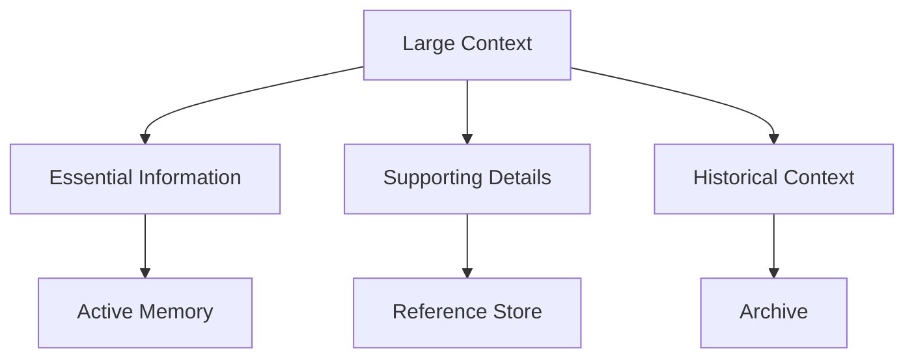
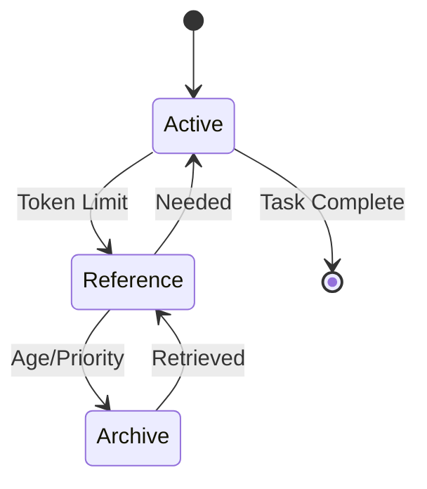

# Standard Operating Procedure: Extended Context Management

## Overview

This SOP outlines strategies and best practices for managing extended context in long-running conversations and complex tasks, ensuring information preservation while handling token limits effectively.

## Context Management Strategies

### 1. Information Chunking

#### 1.1 Chunking Patterns



#### 1.2 Priority Levels

| Level | Type       | Storage         | Access Pattern  |
| ----- | ---------- | --------------- | --------------- |
| P0    | Critical   | Active Memory   | Immediate       |
| P1    | Important  | Reference Store | Quick Retrieval |
| P2    | Historical | Archive         | Background      |

### 2. State Management

#### 2.1 State Object Structure

```python
class ConversationState:
    def __init__(self):
        self.active_context = {}
        self.reference_store = {}
        self.archive = {}
        self.metadata = {
            "last_update": None,
            "token_count": 0,
            "priority_queue": []
        }
```

#### 2.2 State Transitions



### 3. Token Management

#### 3.1 Token Budget Allocation

| Component | Allocation | Purpose           |
| --------- | ---------- | ----------------- |
| System    | 20%        | Core instructions |
| Active    | 50%        | Current context   |
| Reference | 20%        | Quick access      |
| Reserve   | 10%        | Emergency buffer  |

#### 3.2 Token Optimization

```python
def optimize_tokens(context, limit):
    """
    Optimize context to fit within token limit
    """
    # Prioritize information
    priority_queue = sort_by_priority(context)

    # Allocate tokens
    allocated = 0
    optimized = {}

    for item in priority_queue:
        if allocated + item.tokens <= limit:
            optimized[item.key] = item.value
            allocated += item.tokens

    return optimized
```

### 4. Information Preservation

#### 4.1 Context Serialization

```python
def serialize_context(context):
    """
    Serialize context for storage
    """
    return {
        "data": context,
        "metadata": {
            "timestamp": datetime.now(),
            "version": "1.0",
            "checksum": calculate_checksum(context)
        }
    }
```

#### 4.2 Recovery Procedures

```python
def recover_context(checkpoint):
    """
    Recover context from checkpoint
    """
    if validate_checkpoint(checkpoint):
        return restore_from_checkpoint(checkpoint)
    else:
        return restore_from_last_valid()
```

## Implementation Guidelines

### 1. Active Context Management

```python
class ContextManager:
    def __init__(self, max_tokens=25000):
        self.max_tokens = max_tokens
        self.active_context = {}
        self.reference_store = {}

    def add_to_context(self, key, value, priority):
        tokens = count_tokens(value)
        if self.would_exceed_limit(tokens):
            self.optimize_context()
        self.active_context[key] = {
            "value": value,
            "priority": priority,
            "tokens": tokens
        }
```

### 2. Reference Store Management

```python
class ReferenceStore:
    def __init__(self):
        self.store = {}
        self.index = {}

    def add_reference(self, key, value, metadata):
        self.store[key] = value
        self.index[key] = create_index(value, metadata)

    def retrieve_reference(self, query):
        matches = search_index(self.index, query)
        return [self.store[m] for m in matches]
```

### 3. Archive Management

```python
class ArchiveManager:
    def __init__(self, archive_path):
        self.archive_path = archive_path

    def archive_context(self, context, metadata):
        archive_id = generate_id()
        save_to_archive(context, metadata, archive_id)
        return archive_id

    def retrieve_from_archive(self, archive_id):
        return load_from_archive(archive_id)
```

## Best Practices

### 1. Context Preservation

- Regularly checkpoint important context
- Implement versioning for context changes
- Maintain context hierarchy
- Track context dependencies
- Implement recovery mechanisms

### 2. Token Optimization

- Remove redundant information
- Compress repetitive patterns
- Prioritize recent/relevant context
- Implement sliding windows
- Use efficient encodings

### 3. Information Access

- Implement efficient indexing
- Use caching for frequent access
- Maintain access patterns
- Optimize retrieval paths
- Balance speed vs. storage

## Common Scenarios

### 1. Long-Running Conversations

```python
def manage_conversation(conversation):
    # Initialize context
    context = ConversationManager()

    # Process messages
    for message in conversation:
        # Update context
        context.add_message(message)

        # Optimize if needed
        if context.needs_optimization():
            context.optimize()

        # Archive old context
        if context.should_archive():
            context.archive_old_messages()
```

### 2. Complex Task Management

```python
def manage_task_context(task):
    # Initialize task context
    context = TaskContextManager()

    # Track dependencies
    context.add_dependencies(task.dependencies)

    # Manage subtasks
    for subtask in task.subtasks:
        context.track_subtask(subtask)

    # Update progress
    context.update_progress(task.progress)
```

## Troubleshooting

### Common Issues

1. **Token Limit Exceeded**

   - Implement automatic optimization
   - Archive old context
   - Prioritize critical information

2. **Context Loss**

   - Use regular checkpoints
   - Implement recovery procedures
   - Maintain backup contexts

3. **Performance Issues**
   - Optimize storage structure
   - Implement efficient indexing
   - Use appropriate data structures

## References

- [Agency Swarm Documentation](https://github.com/VRSEN/agency-swarm)
- [Token Management Guide](./tool_selection.md)
- [Agent Communication SOP](./agent_creation.md)

## Checklist

- [ ] Context management strategy defined
- [ ] Token budget allocated
- [ ] Optimization procedures implemented
- [ ] Recovery mechanisms in place
- [ ] Performance monitoring setup
- [ ] Documentation complete
- [ ] Testing conducted
- [ ] Integration validated
