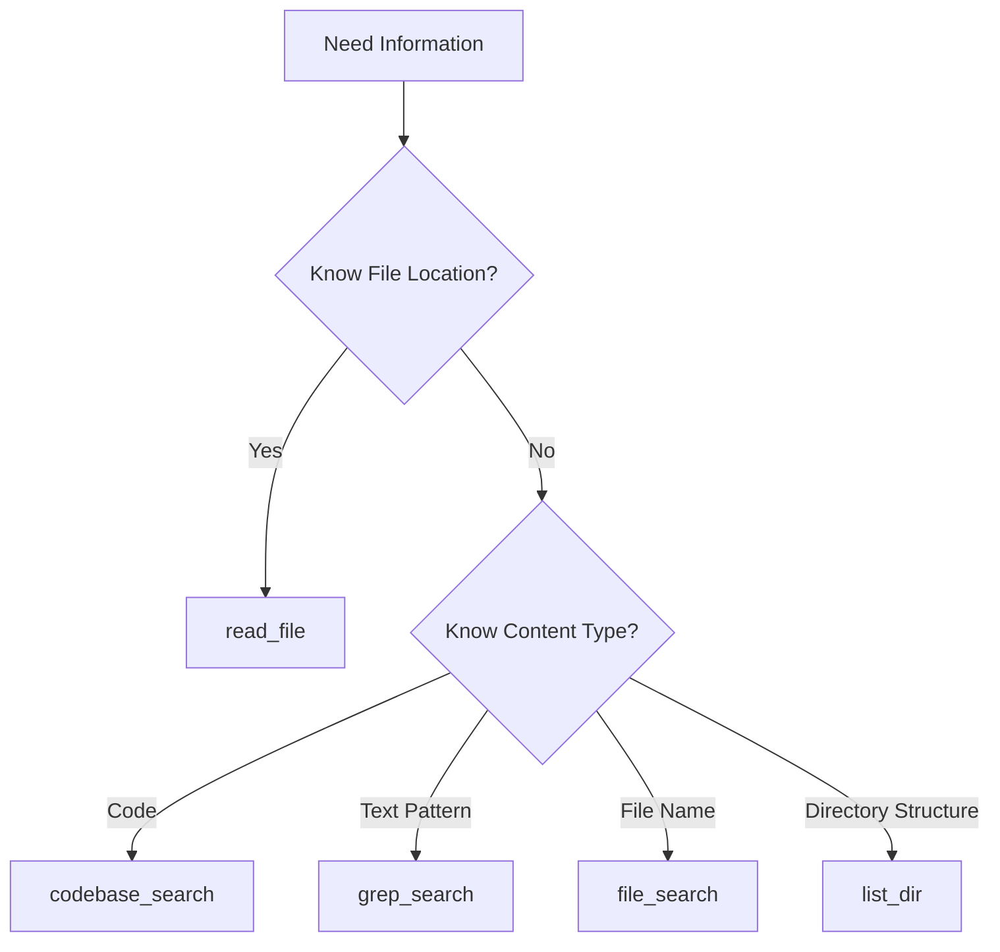
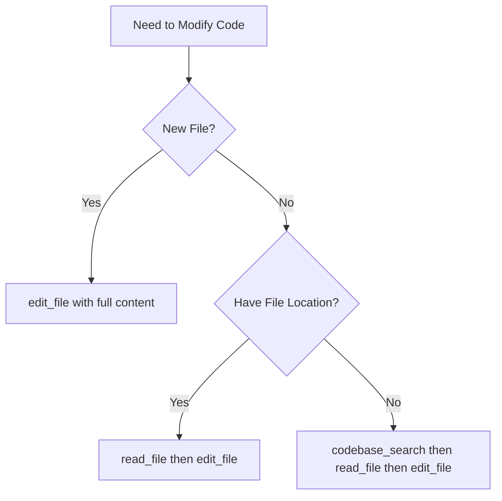

# Standard Operating Procedure: Tool Selection and Usage

## Overview

This SOP provides guidelines for selecting and using appropriate tools for common tasks, ensuring efficient and effective tool utilization within the Agency Swarm framework.

## Tool Selection Flowchart

### 1. Information Gathering Tools



### 2. Code Modification Tools



## Common Task Patterns

### 1. File Operations

#### Finding Files

```python
# When you know part of the file name
file_search(query="filename_pattern")

# When you need to explore directory structure
list_dir(relative_workspace_path="path/to/dir")

# When you need to find code by content
codebase_search(query="relevant code pattern")
```

#### Reading Files

```python
# Reading specific lines
read_file(
    relative_workspace_path="path/to/file",
    start_line_one_indexed=10,
    end_line_one_indexed_inclusive=20
)

# Reading entire file (use sparingly)
read_file(
    relative_workspace_path="path/to/file",
    should_read_entire_file=True
)
```

#### Modifying Files

```python
# Adding new content
edit_file(
    target_file="path/to/file",
    instructions="Adding new function",
    code_edit="""
    // ... existing code ...
    new_content
    // ... existing code ...
    """
)

# Fixing failed edits
reapply(target_file="path/to/file")
```

### 2. System Operations

#### Running Commands

```python
# Basic command execution
run_terminal_cmd(
    command="command_here",
    is_background=False,
    require_user_approval=True
)

# Long-running background tasks
run_terminal_cmd(
    command="long_running_command",
    is_background=True,
    require_user_approval=True
)
```

## Tool Selection Guidelines

### 1. Information Gathering

| Tool              | When to Use                        | Example Scenario                                     |
| ----------------- | ---------------------------------- | ---------------------------------------------------- |
| `codebase_search` | Finding relevant code semantically | Looking for implementation of specific functionality |
| `grep_search`     | Finding exact text matches         | Looking for specific function calls or variables     |
| `file_search`     | Finding files by name              | Locating configuration or specific file types        |
| `list_dir`        | Exploring directory structure      | Understanding project organization                   |
| `read_file`       | Examining file contents            | Reading implementation details                       |

### 2. Code Modification

| Tool          | When to Use         | Example Scenario                               |
| ------------- | ------------------- | ---------------------------------------------- |
| `edit_file`   | Making code changes | Adding new functions, fixing bugs              |
| `reapply`     | Fixing failed edits | When edit_file doesn't apply changes correctly |
| `delete_file` | Removing files      | Cleaning up obsolete code                      |

### 3. System Interaction

| Tool               | When to Use               | Example Scenario                   |
| ------------------ | ------------------------- | ---------------------------------- |
| `run_terminal_cmd` | Executing system commands | Running tests, installing packages |

## Best Practices

### 1. Tool Chaining

- Start with information gathering
- Verify context before modifications
- Use appropriate tool combinations
- Maintain state awareness
- Handle errors between steps

### 2. Context Management

- Gather sufficient information before edits
- Verify file contents before modifications
- Maintain awareness of directory structure
- Track related files and dependencies
- Consider impact on other components

### 3. Error Handling

- Validate inputs before tool use
- Check tool operation results
- Handle failed operations gracefully
- Provide clear error information
- Implement appropriate recovery steps

## Common Scenarios

### 1. Adding New Feature

1. Search for related code
2. Read existing implementations
3. Plan modifications
4. Make changes
5. Verify changes

```python
# Example flow
codebase_search(query="related functionality")
read_file(relative_workspace_path="found_file.py")
edit_file(target_file="found_file.py", instructions="Add new feature")
```

### 2. Bug Fixing

1. Locate problematic code
2. Understand context
3. Make fixes
4. Verify changes

```python
# Example flow
grep_search(query="error_pattern")
read_file(relative_workspace_path="buggy_file.py")
edit_file(target_file="buggy_file.py", instructions="Fix bug")
```

## Troubleshooting

### Common Issues

1. **Tool Selection Errors**

   - Verify tool appropriateness
   - Check required parameters
   - Confirm tool availability

2. **Operation Failures**

   - Verify input parameters
   - Check file permissions
   - Validate file paths

3. **Context Issues**
   - Gather more information
   - Verify assumptions
   - Check related components

## References

- [Agency Swarm Tool Documentation](https://github.com/VRSEN/agency-swarm)
- [Tool Development Guidelines](./tool_creation.md)
- [Context Management SOP](./context_management.md)

## Checklist

- [ ] Identified appropriate tool
- [ ] Gathered necessary context
- [ ] Validated parameters
- [ ] Executed operation
- [ ] Verified results
- [ ] Handled any errors
- [ ] Updated related components
